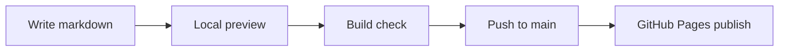

## Build Pipeline

## What to edit first

- Add your first lesson pages under `docs/`.
- Update nav and sidebar in `docs/.vitepress/config.mts`.
- Follow `docs/CONTRIBUTING.md` for update, preview, and publish steps.
